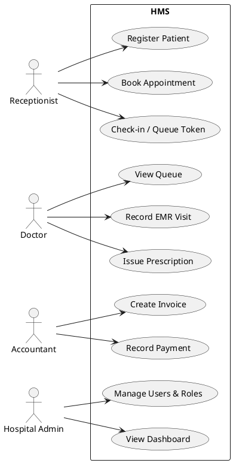
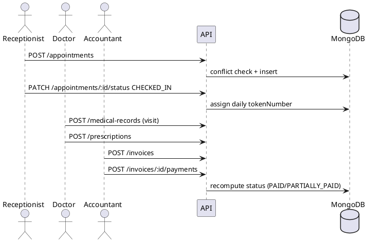

# System Design & Architecture
## Enterprise Hospital Management System

**Version:** 1.0 | Companion to [01-SRS.md](01-SRS.md)

---

## 1. High-Level Architecture

```
                        ┌──────────────────────────────────────────────┐
                        │                 Cloud (SaaS)                 │
 ┌──────────┐  HTTPS    │  ┌─────────┐   ┌──────────────────────────┐  │
 │ Browser  │──────────▶│  │  Nginx  │──▶│  Frontend (React SPA)    │  │
 │ (staff)  │           │  │ /api ─┐ │   └──────────────────────────┘  │
 └──────────┘           │  └───────┼─┘                                 │
                        │          ▼                                   │
                        │  ┌──────────────────────────────┐            │
                        │  │  Backend API (NestJS, REST)  │  stateless │
                        │  │  auth · rbac · tenancy       │  × N pods  │
                        │  └───────┬──────────────┬───────┘            │
                        │          ▼              ▼                    │
                        │   ┌──────────┐    ┌─────────┐                │
                        │   │ MongoDB  │    │  Redis  │ (cache/BullMQ) │
                        │   │ (shared, │    └─────────┘                │
                        │   │ tenantId)│                               │
                        │   └──────────┘                               │
                        └──────────────────────────────────────────────┘
```

- **SPA ↔ API:** JSON over HTTPS, versioned prefix `/api/v1`, JWT bearer auth.
- **Stateless API** → horizontal scaling behind a load balancer; session state lives in the JWT +
  refresh-token hash in MongoDB.
- **Future-ready seams:** notification and report generation flow through service interfaces so
  BullMQ workers, RabbitMQ/Kafka, S3, Elasticsearch, Prometheus/Grafana attach without refactoring.

## 2. Multi-Tenant Architecture (shared DB)
- Every business collection carries an indexed `tenantId` (ObjectId → `tenants` collection).
- JWT payload contains `tenantId`; a global `JwtAuthGuard` attaches the authenticated user, and
  every service query is built from `user.tenantId` — **the client can never supply tenant scope**
  (SUPER_ADMIN may impersonate a tenant via `x-tenant-id`, checked in the guard layer).
- Unique indexes are compound with `tenantId` (e.g. `{tenantId, email}`, `{tenantId, mrn}`).
- Tenant provisioning = insert tenant + issue HOSPITAL_ADMIN; no infra work per tenant.
- Escape hatch to DB-per-tenant later: repository layer takes tenant context as a parameter.

## 3. Backend Architecture (NestJS)

Layered, modular monolith — module boundaries match future microservice seams.

```
backend/src/
├── main.ts                  # bootstrap: helmet, CORS, pipes, swagger, prefix
├── app.module.ts
├── config/                  # typed, validated env configuration
├── database/                # mongoose connection module
├── common/                  # cross-cutting, zero business logic
│   ├── decorators/          # @Public @Roles @Permissions @CurrentUser
│   ├── guards/              # JwtAuthGuard RolesGuard PermissionsGuard
│   ├── filters/             # AllExceptionsFilter (RFC-ish error envelope)
│   ├── interceptors/        # TransformInterceptor, AuditInterceptor
│   ├── dto/                 # PaginationQueryDto
│   └── enums/  utils/
└── modules/
    ├── auth/                # controller service strategies dto
    ├── tenants/ users/ roles/
    ├── departments/ patients/ doctors/ appointments/
    ├── medical-records/ prescriptions/ billing/
    ├── audit/ reports/
    └── <future: pharmacy, lab, radiology, inventory, insurance, notifications, files>
```

Per module: `*.module.ts`, `*.controller.ts` (HTTP only), `*.service.ts` (business rules),
`schemas/` (Mongoose), `dto/` (class-validator). Controllers never touch Mongoose models.

### Request pipeline
`Throttler → JwtAuthGuard → RolesGuard → PermissionsGuard → ValidationPipe(whitelist) →
Controller → Service → Model` — responses wrapped by `TransformInterceptor` as
`{ success, data, meta? }`; errors normalized by `AllExceptionsFilter` as
`{ success:false, statusCode, message, errors?, path, timestamp }`; mutations logged by
`AuditInterceptor`.

## 4. Database Design (MongoDB)

| Collection | Key fields | Indexes |
|---|---|---|
| tenants | name, **code**, gstin, contact, isActive | `{code}` unique |
| users | tenantId, email, passwordHash, role, refreshTokenHash, isActive | `{tenantId,email}` unique |
| roles | tenantId?, **name**, permissions[], isSystem | `{tenantId,name}` unique |
| patients | tenantId, **mrn**, name, dob, gender, phone, abhaId, allergies[] | `{tenantId,mrn}` unique, `{tenantId,phone}`, text(name) |
| departments | tenantId, name, **code**, headDoctorId | `{tenantId,code}` unique |
| doctors | tenantId, userId?, name, specialization, departmentId, licenseNumber, fee, schedule[] | `{tenantId,departmentId}` |
| appointments | tenantId, patientId, doctorId, scheduledAt, endsAt, status, tokenNumber | `{tenantId,doctorId,scheduledAt}`, `{tenantId,patientId}` |
| medicalrecords | tenantId, patientId, doctorId, appointmentId?, vitals{}, diagnoses[], notes | `{tenantId,patientId,createdAt}` |
| prescriptions | tenantId, patientId, doctorId, recordId?, items[] | `{tenantId,patientId}` |
| invoices | tenantId, **invoiceNumber**, patientId, items[], totals, payments[], status | `{tenantId,invoiceNumber}` unique, `{tenantId,status}` |
| auditlogs | tenantId, userId, action, resource, resourceId, ip, statusCode, ts | `{tenantId,createdAt}`, TTL exempt |
| counters | tenantId, key (mrn/invoice), seq | `{tenantId,key}` unique |

Relationships are by ObjectId reference + `populate` for read paths; no cross-tenant refs.
Sequential numbers (MRN, invoice) come from atomic `findOneAndUpdate` on `counters`.

## 5. API Design
REST, plural nouns, versioned: `POST /api/v1/patients`, `GET /api/v1/appointments?status=…&page=…`.
Standard contract per endpoint (auth required unless `@Public`): declared permission, validated
DTO, paginated list responses `{ data, meta:{page,limit,total,totalPages} }`, error envelope above.
Full live contract is served by **Swagger at `/api/docs`** (generated from decorators — the
single source of truth, kept honest by the code itself).

## 6. AuthN / AuthZ
- **Access token** (15 min, `sub`, `tenantId`, `role`, `permissions`) + **refresh token**
  (7 d, rotated on use, bcrypt-hashed in the user document; logout clears it).
- Password hashing: bcrypt cost 12. MFA-ready: auth service isolates credential verification.
- **RBAC + permissions:** `@Roles(...)` for coarse gates, `@Permissions('patients:create')` for
  fine gates; permission catalog is code-defined; roles (system + tenant-custom) bundle them.

## 7. Security Architecture
helmet (secure headers) · strict CORS allow-list · @nestjs/throttler rate limiting ·
whitelisted ValidationPipe (rejects unknown fields) · bcrypt-hashed secrets · JWT secrets via env ·
tenant scoping at service layer · immutable audit logs · Mongo query-injection safe DTO types ·
no stack traces in production errors.

## 8. Performance, Logging, Monitoring, Backup
- **Performance:** compound indexes above; pagination mandatory; `lean()` reads; React Query
  client cache; Vite code-splitting per route; Redis reserved for hot caches + BullMQ.
- **Logging:** Nest Logger with request context now; pluggable to pino → ELK later.
- **Monitoring:** `/api/v1/health` (liveness/readiness); Prometheus metrics endpoint is a
  planned interceptor — no refactor needed.
- **Backup/DR:** `mongodump` nightly → object storage, 30-day retention; RPO 24 h / RTO 4 h MVP;
  replica set + PITR (oplog) in production tier.

## 9. Frontend Architecture (React + Vite + TS)
```
frontend/src/
├── api/          # axios instance (auth+refresh interceptors), typed endpoint fns
├── auth/         # AuthProvider (context), ProtectedRoute (role/permission aware)
├── components/   # ui/ (Button, Input, Select, Modal, Table, Badge…), layout/ (Shell, Sidebar)
├── hooks/        # useAuth, usePagination
├── lib/          # queryClient, zod schemas, formatters
├── pages/        # login, dashboard, patients, doctors, departments, appointments,
│                 # records, billing, users, roles, audit
└── types/        # API models
```
Patterns: React Query for all server state (no duplicated client stores); React Hook Form + Zod
resolver for every form; role-based routing + menu filtering; loading/empty/error states on every
list; Tailwind design tokens for consistency.

## 10. Deployment Architecture
Docker Compose (dev/single-node): `mongo`, `redis`, `backend` (Node 20 multi-stage image),
`frontend` (Nginx serving the built SPA and proxying `/api` → backend). Production path:
same images behind a managed LB, MongoDB Atlas/replica set, managed Redis; Kubernetes manifests
are a packaging change only (stateless API).

## 11. UML (PlantUML sources)

### 11.1 Use case (core flow)


### 11.2 Sequence — consultation & billing


### 11.3 Class (domain excerpt)
```plantuml
@startuml
class Tenant { code; name; gstin }
class User { email; role; permissions }
class Patient { mrn; abhaId; allergies }
class Doctor { specialization; fee; schedule }
class Appointment { scheduledAt; status; tokenNumber }
class MedicalRecord { vitals; diagnoses; notes }
class Invoice { items; total; payments; status }
Tenant "1" o-- "*" User
Tenant "1" o-- "*" Patient
Patient "1" o-- "*" Appointment
Doctor "1" o-- "*" Appointment
Appointment "1" o-- "0..1" MedicalRecord
Patient "1" o-- "*" Invoice
@enduml
```
(Activity/component/deployment diagrams follow §1, §3 and §10 respectively; rendered versions to
be added to `docs/diagrams/` in the documentation sprint.)

---
*Phase 2 review: architecture validated against SRS NFRs — tenancy isolation is centralized (not
per-endpoint), auth is refresh-rotation safe, every list path is paginated and indexed, and each
"later" enterprise service (queueing, search, metrics, storage) has a named seam. Improvement
adopted during review: counters collection for atomic per-tenant sequences instead of max()+1.*
